# Trade Control - Network Demo

Demonstrating how to set up supply chains: organising production, commerce and financial exchange. It assumes you are familiar with the system or have completed the [BOM demo](https://github.com/tradecontrol/tc-office/blob/master/docs/tc_demo_manufacturing.md). If you are following the [Bitcoin Demo](https://github.com/tradecontrol/tc-bitcoin/blob/master/docs/tc_bitcoin_demo.md), the procedure is the same as that for fiat currencies, except for the [payment](#payment).

## Setup

### Requirements

- [Test Environment](../readme.md#test-environment)
- [TC Node](https://github.com/tradecontrol/tc-nodecore) - Fiat >= 3.27.1; Bitcoin >= 3.28.3
- [TC Office](https://github.com/tradecontrol/tc-office) - Fiat >= 3.13.1; Bitcoin >= 3.14.1

### Database

Firstly, we create a simple supply chain in the form Retail -> Secondary Industry -> Primary Industry ([UI -> CI -> MI](https://github.com/iamonnox/tradecontrol/blob/master/docs/tc_functions.md#interfaces)). Because we will be simulating the actions of three separate business entities, it may seem more complicated than it is. In a live environment you would only interact with the network from the vantage of a single entity. 

1. Create three databases: tcTHEBUS, tcPLAPRO and tcSTOBOX with corresponding 64bit ODBC data sources.
2. Configure each database using the [node installer](https://github.com/TradeControl/tc-nodecore/blob/master/docs/tc_nodecore_config.md) with a different business name for each (e.g. THE BUSINESS, PLASTICS PROVIDER, THE STORAGE BOX COMPANY). Accept the other defaults, including the Basic Configuration page.
3. Install the [BOM Demo](https://github.com/tradecontrol/tc-office/blob/master/docs/tc_demo_manufacturing.md) into tcTHEBUS, **Activities option only**.
4. Open the client and for each database [set up a connection](https://github.com/TradeControl/tc-office#connection).
5. Optionally, [copy the Office interface](https://github.com/tradecontrol/tc-office/blob/master/src/access) into two additional folders and run [the client](https://github.com/tradecontrol/tc-office/blob/master/src/access/TCnode_3.accde) separately for each business. Change the Application Titles to facilitate switching businesses across the supply chain. 
5. Connect to tcPLAPRO and in Organisations, Quick Entry, add account THE BUSINESS as a Customer, specifying payment terms (COD etc) and Standard Rate Vat. Then connect to tcSTOBOX and add THE BUSINESS as a supplier.

> Account Codes do not have to match because each node maps its internal codes to Externally Owned Accounts (EOA).

### Consortium

Secondly, we connect the supply chain together using Ethereum.

1. Load Ganache and create a new workspace TRADE-CONTROL. This presents a private offline Ethereum node. Ganache gives each account 100 ETH to play with, so you do not need to transfer currency. Copy the RPC Server address (Remote Procedure Call interface).
2. Open the Network Interface, select the tcTHEBUS database in the Sql Server page and connect. Paste the RPC Server address into the Url of the Network and connect.
3. From the Ganache Accounts page, use the keys from the first account listed. It will look like this:

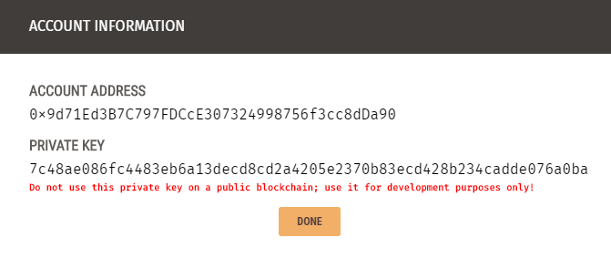

4. Paste the public and private keys into the Network page and click Save:

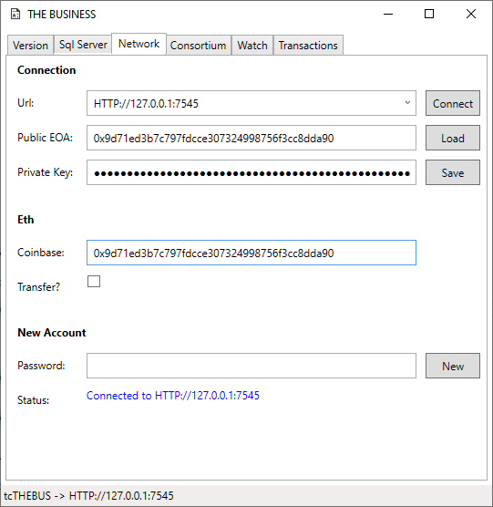

5. Deploy the byte code of the [Org.sol contract](tc_network_spec.md) from the Consortium page. It will return a contract address which identifies the location of the Consortium on the blockchain. From Ganache the transaction count is incremented, and the balance is reduced to pay for the administration cost. This is also recorded in the Transactions page of the Network Interface.
6. Open another two instances and repeat 2-5 for tcPLAPRO and tcSTOBOX.  Each will then have a unique Public EOA address that owns the contracts and pays the fees, and a Consortium Address to register contract deployments and events.
7. We now need to connect the Org contracts to form a consortium using their unique keys. THE BUSINESS will have two members (a customer and supplier), whilst the others will have only one. So, the supply chain is THE STORAGE BOX COMPANY -> THE BUSINESS -> PLASTICS PROVIDER. This is just before the STOBOX keys are added to THE BUSINESS instance:

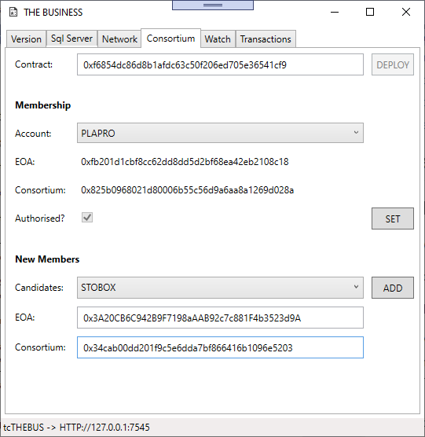

Here's the STORAGE BOX COMPANY instance as well:

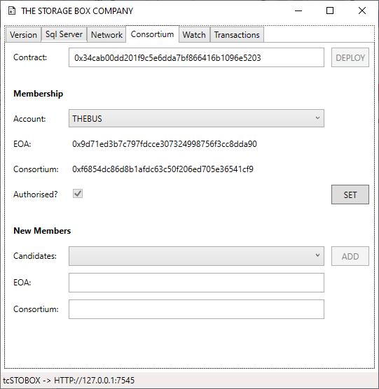

> Make sure the keys are correct because the blockchain is immutable. An error at this stage would involve de-activating the account and re-creating it with a new code.  

8. Test everything is working by selecting a member account. The keys should be obtained from the EOA's Org contract. Then set the authorisation status on and off. Because this is a change in the state of the blockchain, there is a transaction cost:  

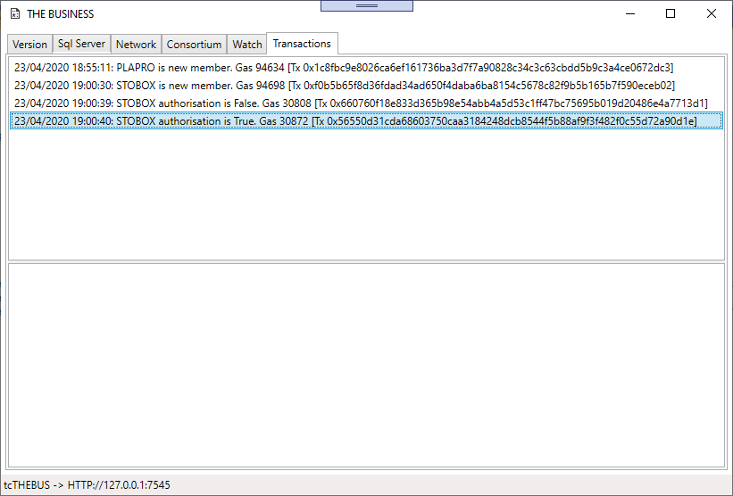

9. Although we are not using the EVM to transact payments, live installations would require that you secure your private key. This is written to table _App.tbEth_; therefore, only the Sql User running the service needs access to this table. The keys of suppliers and customers are stored on the blockchain in the Org contract. At the same time, the **TransmitStatusCode** of the account is set to **Deploy**, determining the communication status of events written to the Task or Invoice change logs. Having added members to the tcTHEBUS consortium, the Organisation datasheet reflects this:

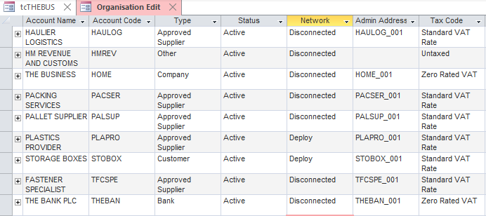

## Network Communications

### Activity Mirroring

1. With the three instances of the Network Interface connected to the RPC Server, start each Watch Service in Passive Mode and view the Transactions page:

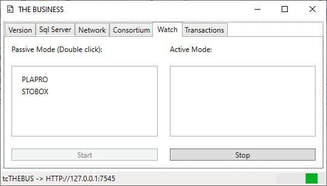

2. Connect to tcTHEBUS in the Node Installer and run the manufacturing demo data creation script with the Create Orders option on. 

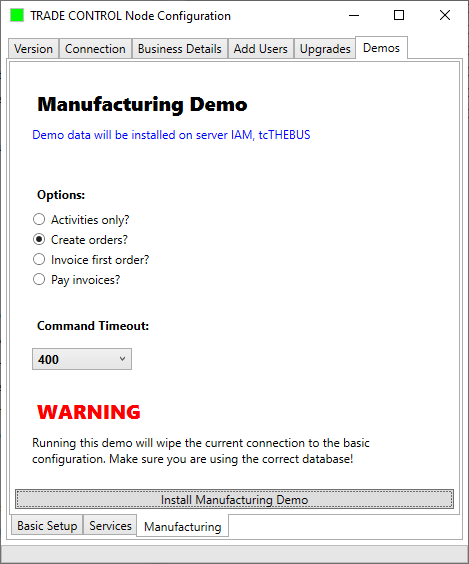

> **Note**
> 
> For simplicity, the demo will give us only a single product to play with. To fully understand allocations and object mirroring you would need more than one product. The [Power-BI repository](https://github.com/tradecontrol/tc-powerbi) contains a T-SQL script that will create several additional products (albeit the same product in different colours) and a corresponding order book. This makes supply-chain operation more involved, but it generates a more realistic set of allocations against the tcPLAPRO supplier and the tcSTOBOX customer. To install this dataset, download the [netdemo_data_extension.sql](../src/scripts/netdemo_data_extension.sql) script and from SSMS run it against the tcTHEBUS database.

3. Switch immediately back to the three Network Interfaces. You should see transactions being written to THE BUSINESS service as it deploys task contracts to the blockchain, with corresponding events emitted to the other two accounts. The Ganache accounts page will show a reduction in ETH and an increase in Tx count (around 120). Their transaction page records the contract deployments and calls.
4. Unless ordering takes place via a catalogue, most object codes differ between companies. The first task, therefore, is to mirror these codes and write them to the blockchain. Connect to tcPLAPRO and open Network Allocations. Unknown, new materials await mirroring so that they can be identified. These activities are called Allocation Codes. There are three options: Create a new activity; assign to an existing code; and map to a catalogue identity (when Mirrors? is checked). Assignment would be the norm, but here we need to create mirror activities. Once mirrored the allocation code is removed from this list.

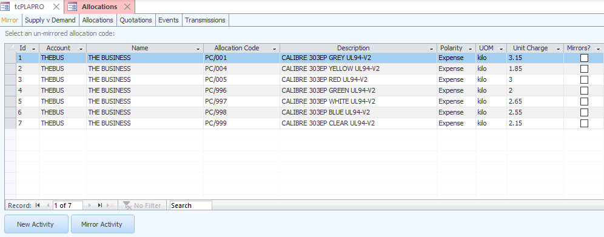

5. Assuming you have read the paper and tried out the demos, you will know that a mirror activity reverses the polarity of both quantity and value. The above allocation codes are cost negative and quantity positive, so we need to mirror onto a code that has the opposite polarities. The Transmit Status is set to Deploy because THEBUS account is a member of the consortium. The mirror is subsequently sent over the EVM to be recorded in the account's Org contract. Check out the Network Interfaces and you will see a mirror transaction on tcPLAPRO and a corresponding event on tcTHEBUS.

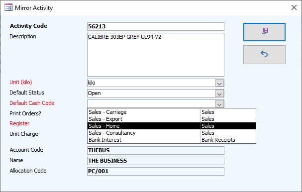

6. When the Mirror list is empty THE BUSINESS account in tcPLAPRO Organisations should look something like this:

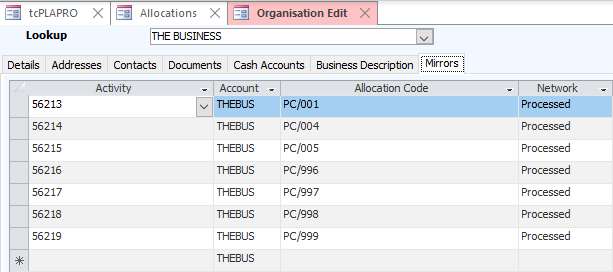

7. Open the Storage Box Company and mirror the supplier's allocation codes with a corresponding identity with the opposite polarity. Normally, allocation codes are sent down the supply chain from the customer, but the demo has pushed its codes from the supplier. However, it makes no technical difference which party initiates the mirroring process. For the following demo, map **M/00/70/00** (finished product) to **SB-9653** (bought-out component).
 
### Network Transactions

Now that the consortium has been created and activities mirrored, order books can be exchanged over the network. However, it is not possible to mirror order books in many circumstances; instead, we employ the manufacturing systems solution of allocations. It is the set of all allocations that become mirrored by either party. To understand how that works practically, it is best to start with the Plastic Supplier.

1. From the Network Allocations for the Plastic Provider (tcPLAPRO), you will see each order placed by The Business (tcTHEBUS). The quantities are negative because the activity is consumed in the act of delivery. The idea therefore is to position supply tasks such that the balance is always positive.

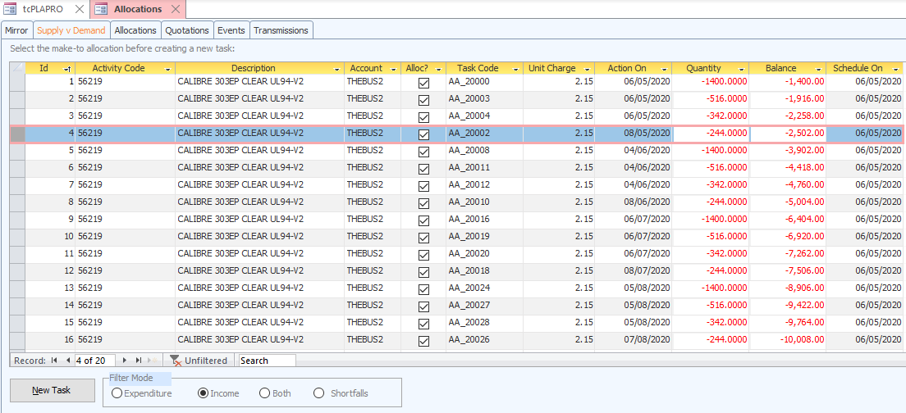

2. We are going to supply these allocations with one delivery of each type of plastic every month. Selecting Allocation Id 4, the Scheduled-On date is the Action On date of Id 1, and the balance is the accumulated quantity between the two. Raising a new task from Id 4 (ALT+N, ALT+A) therefore fills in these values automatically, along with the other details of the allocations (account, activity code, cash code, tax code...). Increase the quantity to a round number and the Supply versus Demand (SvD) balance is altered where the supply order is slotted into schedule. The Scheduled-On date for the Activity Code is now moved to the next Id where there is a shortfall. By selecting the last Allocation Id of each month and raising a new task, you are scheduling the supply to ensure the customer will always have the goods or service in time for the allocation. For material **56219** there will be five orders to match the demand of the five orders placed by The Box Company further up the chain. The Shortfall option is used for locating scheduling requirements on live datasets.

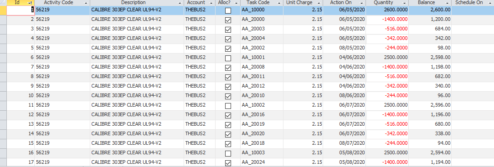

3. Now re-connect to tcTHEBUS who owns these allocations and open the Network Allocations SvD form. Switch to Expenditure, and you will see that the allocations are now mirroring the plastic supplier (ref. Alloc flag). Because code **PC/001** has no shortfalls, the Controller knows that the supplier will deliver the material needed to meet the current production schedule.

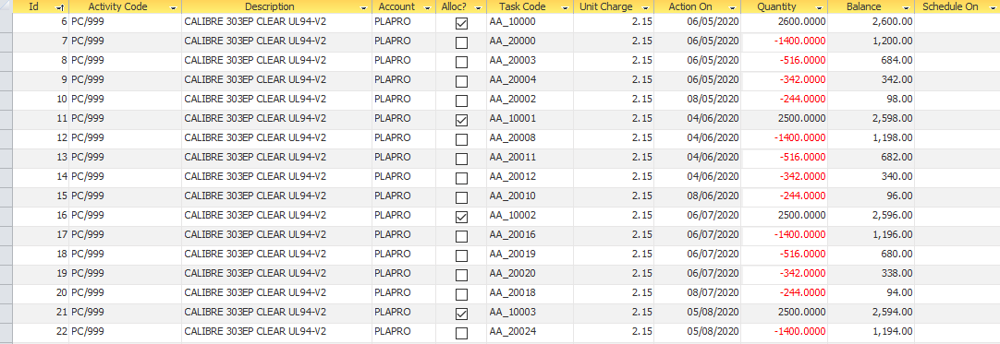

4. On selecting Income, you will find there are no demand allocations that take the supply. Normally, the supplier would never send a sales order to the customer without first receiving instruction; but we are using the Demo Data to push supply. Therefore, the balance just keeps going up (5000 for **M/00/70/00**). Open the Network Allocations SvD for tcSTOBOX and the Schedule-On dates will be empty for the same reason. [Mirror the assembly](#activity-mirroring) **M/00/70/00** to a new activity **SB-9653**.  As customer, The Box Company is not interested in matching the supplier's allocations, only ordering what it needs. Open Task Explorer and create 5 purchase orders for 2000 in each of the months. Switch to the tcTHEBUS supplier, and the customer now presents them with a new schedule where the projected balance is negative:
 
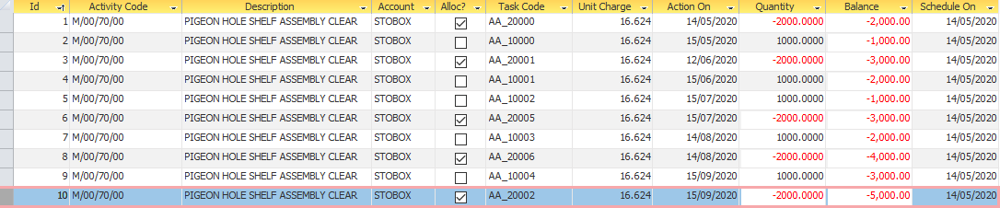

5. Reschedule each task (ALT+E edit ALT+R, ALT+C) in turn by changing the quantity and action on dates so that the SvD balance is always above zero. Switch back to The Box Company and you will see that it now mirrors the amended allocations and their Controller knows that the supplier has adjusted the delivery schedule to match their requirements:

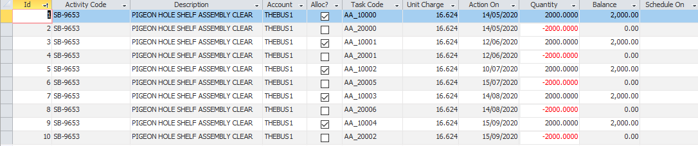

6. Checking out the expenditure SvD for The Business, we find the projected balance for **PC/999** is now seriously out of alignment. Switch to the Plastic Provider tcPLAPRO and it mirrors this mess:

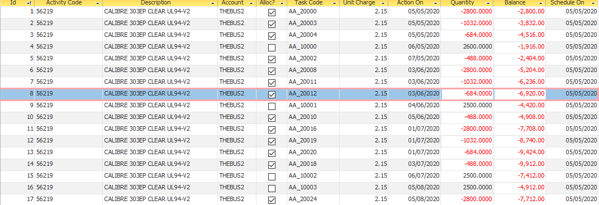

7. We are going to change the five 2.5 tonne shipments to four deliveries, such that the first delivery covers two months requirements. To that end, edit delivery in the third month (**AA_10002**) and set the status to cancelled. Move the second call off to month three. The last allocation in month 2 will show a shortfall of 7408 and a new Schedule On date. Re-schedule **AA_10000** by adding the shortfall to the order quantity (10.1 tonnes) and changing Action On to the new scheduled date. Repeat for the other three orders so that the balance is never below zero (if the Schedule On date is blank then the date is okay). Switching back to The Business, their SvD Expenditure projections have automatically mirrored their supplier's, so the Controller knows the material arrival schedule meets the needs of production.

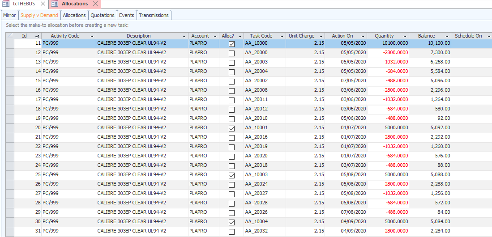

Everything is now in place: demand has cascaded down the supply chain, but nothing has in fact happened. We now need to roll up the production process - from the shipment of material, the manufacture of the goods, to the final delivery of the assembly. Then there is a second cascade down the supply-chain, in the form of money (**Figure 6** in [the accompanying paper](https://github.com/iamonnox/tradecontrol/blob/master/docs/tc_functions.md#supply-and-demand)).

### Events and Transmissions

In manufacturing, despatches are made on a delivery note raised by the Despatch Department and subsequently invoiced by Admin. The reason for this is that delivery notes were once signed with a pen by the customer's Goods Inwards storeman, and the invoice was mailed to their Accounts Department. However, the Trade Control invoice doubles up as a despatch note; therefore, we need to raise invoices to despatch goods (or more generally, deliver a service).

1. For demonstration purposes, stop the tcPLAPRO Network Interface Watch.
2. Connect to tcPLAPRO and from Network Allocations SvD (or Task Explorer), edit the first task for a plastic and deliver half the consignment by choosing Quick Invoice. Add a miscellaneous charge for delivery (**Sales - Carriage**) and amend the Invoice Quantity of the task to half the total consignment. It will ask if you want to reconcile the task to the invoice: make sure you select No or there will be a quantity shortfall. Opening Network Invoices from the main menu, the invoice is awaiting deployment and transmission to the customer. 

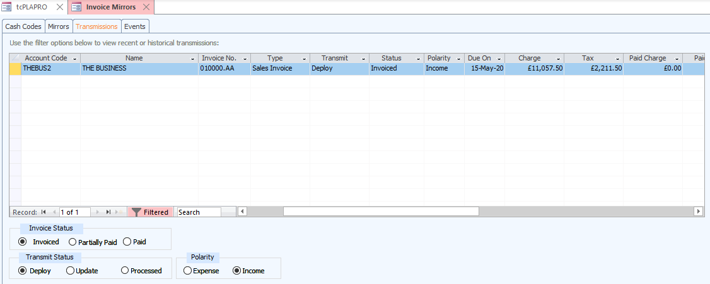

3. The SvD for the delivered plastic will still show that the allocations have not been satisfied. That is because the customer must mirror the sales invoice/despatch note with a corresponding purchase invoice/goods receipt note(GRN). When the delivery is accepted, the quantity is communicated over the network and the allocations updated accordingly.
4. Re-start the tcPLAPRO Network Interface Watch and the sales invoice will be sent to tcTHEBUS via the EVM. Connect to tcTHEBUS and look at the SvD expenditure. It is now the inverted image of the supplier's invoice. The invoice has been received but the customer's allocations remain. Just as raising an invoice with a positive cash polarity constitutes a delivery, we need to mirror this to transact a receipt (GRN).
5. Open Network Invoices and you will be presented with the plastic supplier's carriage charge. As with [Activity Mirroring](#activity-mirroring), you will need to mirror their income Charge Code to a corresponding Direct Expense.

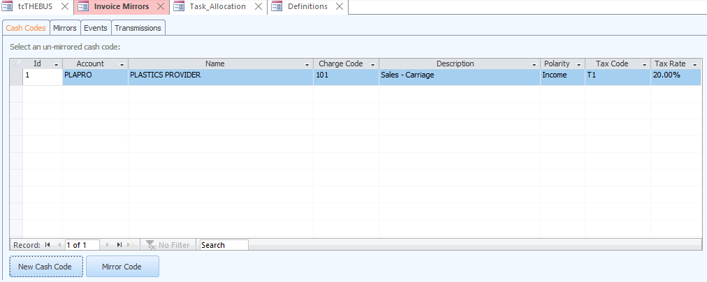

6. The Mirror Code button assigns a Charge Code to an existing Cash Code. However, the demo data does not have a Cash Code to pay for carriage, so use the New Cash Code button to create one. The Category list will only show categories that are opposite to the mirrored charge code, and the Tax Code list matches the supplier's rate.

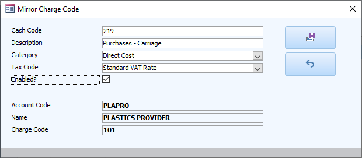

7. Opening Definitions, you can amend and view all the Cash Code mirrors by using the + sign in the Cash Code page. All mirrors for any given business can also be edited in Organisation Maintenance. The mirror you created in the previous step will have been automatically sent over the network to the supplier, so that when you mirror their sales invoices the supplier does not need to repeat this process.
8. Now the invoice is both mapped to known allocations and cash codes, the supplier's formal demand for payment can be processed. You must mirror their invoice so that it is signed off on the blockchain, the supplier is notified of your acceptance and the SvD allocations are adjusted.  The Mirrors page should look something like this:

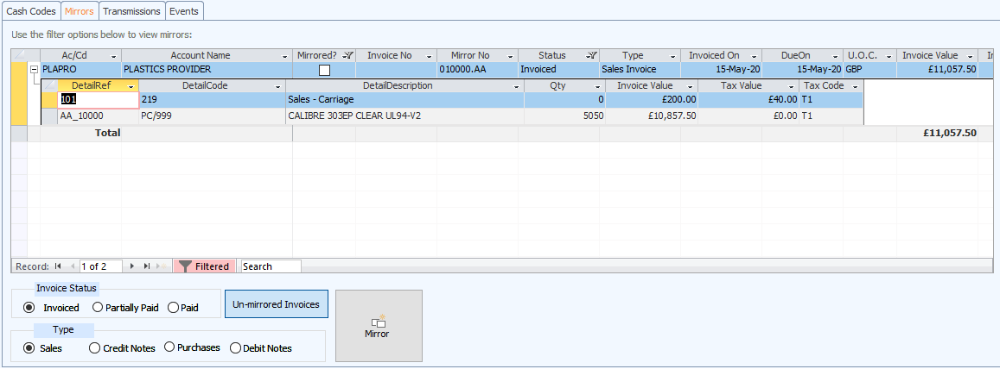

9. Select an invoice and press Mirror. Providing all codes are mapped and known, the algorithm works through the SvD in FIFO order to construct and reference a pending invoice to match. The invoice is loaded for approval. Once it is accepted, the [mirror invoice](tc_network_spec.md) will be written to the blockchain and the supplier notified. That sorts out the customer’s SvD, but it will also do the same for the supplier. 

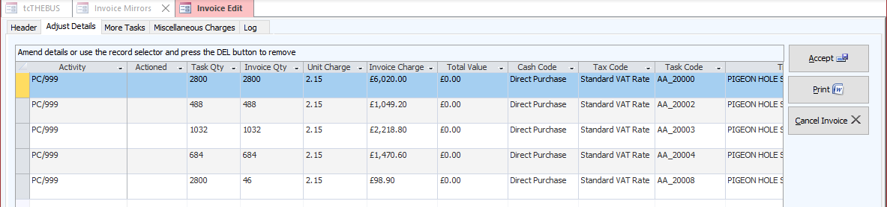
 
10. Because the status of the affected tasks and their delivery quantities are communicated, they are removed from the supplier's SvD (or quantity adjusted for partial deliveries as here). The supplier awaits payment in the normal way. Below, we see the supplier has received the mirror and the SvD has been adjusted accordingly.

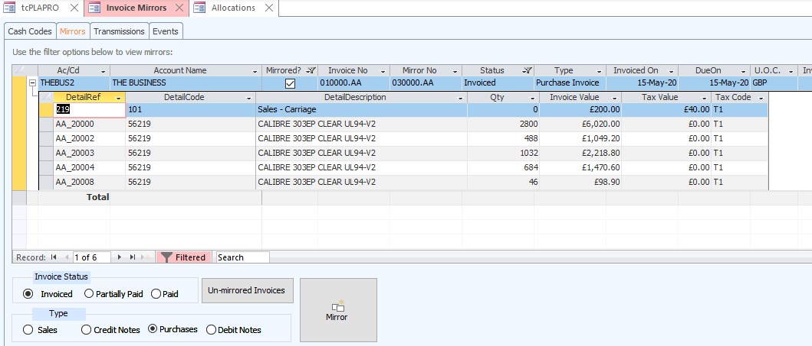

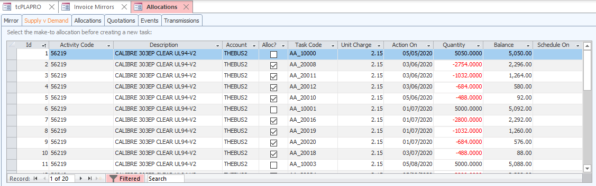

11. Check out the results - not just the allocations, but also the Invoice Register, Company Statement, Organisation Statements and so on. 
12. Switch to tcTHEBUS and open the first order. The materials are ready. Assuming everything else is in place too, with the tasks and operations complete, we can invoice/despatch the sales order. Select **M/00/70/00** and invoice the full shipment to The Box Company (add carriage if you want). If you Save/Refresh, the operations and works orders have been automatically completed. 

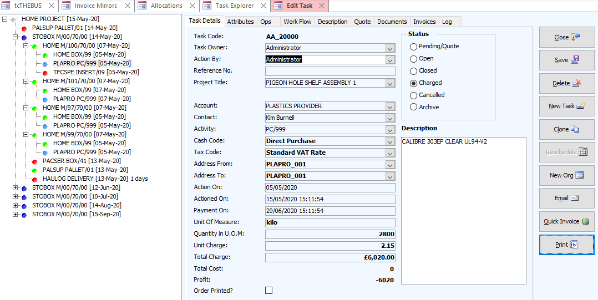

13. The invoice mirror will be sent to tcSTOBOX. Repeat steps 5 - 11, only this time tcTHEBUS is the supplier.

### Payment

As the goods have flowed up the supply chain, so we now go back down again, paying the invoices in exchange for their goods or service. If you are using a fiat currency, this process is controlled by the banks. Otherwise, you can pay directly from your [Bitcoin Wallet](https://github.com/tradecontrol/tc-bitcoin).

#### Fiat

1. From tcSTOBOX, look at the Company Statement. Open Payment Entry and pay the plastic supplier (assuming an overdraft). You only need to select the organisation and post the defaults. The current balance of the Company Statement is reduced accordingly, and the invoices removed. A payment event is sent to the supplier notifying them that you have paid up, but their mirror invoice remains unpaid.
2. Connect to tcTHEBUS. Check out the network allocations, invoice mirrors and events to see how they have been automatically updated over the network. Enter the customer's payment to complete the process and a payment event will be sent out. The goods have been successfully delivered to the customer (quantity in, cash out), and in exchange, the money paid to the supplier (quantity out, cash in). Because both parties enter payments from their respective bank statements, the payment notification events automate confirmation that the money has been received.

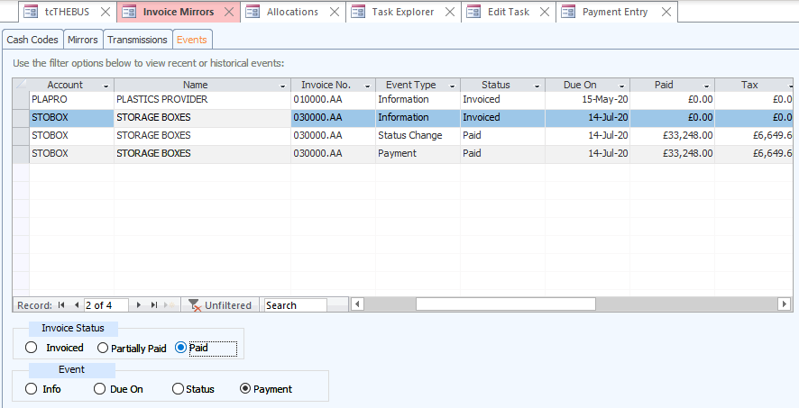

3. Pay the Plastic Provider and open their instance. When you have entered the payment as income their Company Statement will now show a positive opening balance (the statement does not show paid invoices):

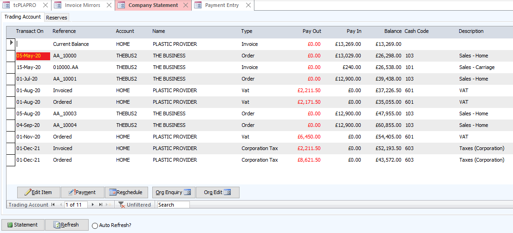

### Credits and Returns

Normally one of two things can go wrong in a trading exchange - faulty goods or bad service and mischarges. With Trade Control, you could just send an invoice with a negative quantity or charge, but it would go against convention. For faulty goods, the customer would send them back on a return note with an accompanying debit note. Should the supplier accept this, they would mirror it with a credit note. Internally, these states [are modelled using polarity](tc_network_spec.md). Also, you can always raise invoices directly for miscellaneous charges with no supply/demand implications. For mischarges, you can also use zero quantities.

1. From the Task Explorer, we know that 5 tonnes of plastic were used to satisfy the monthly consignment of **M/00/70/00**. However, the QC department of The Business reject a 250Kg bag of PC/999 granules due to contamination. They return it to the supplier by raising a debit/return note and deleting/editing the invoice lines to debit 250Kg. Leave the defaulted carriage charge on the debit note. 

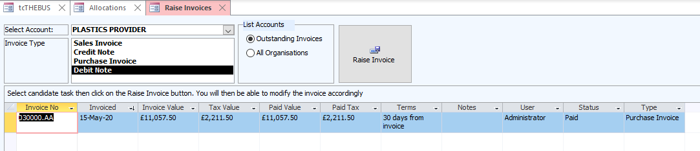

2. Switch to the plastic supplier. When we mirror the debit submission it creates a corresponding credit note and returns the 250Kg to the material's SvD listing for both parties (**AA_10000** 5050 -> 5300). However, they dispute the carriage charge debit, and therefore send a debit note to cancel that out. The customer accepts the error and mirrors a credit note. The Plastic Provider's version of their customer's invoice mirrors now looks like this:

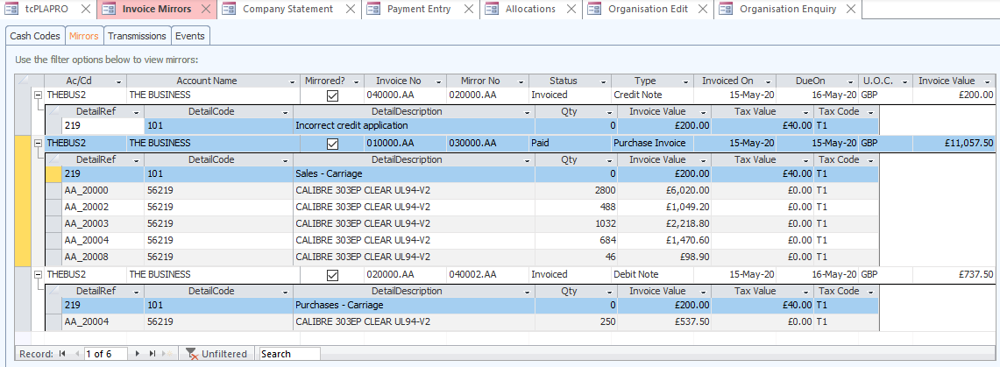

3. The respective Account Statements in the Organisation Enquiry show a mirroring of the money (demand projection), just as the respective SvD listings mirror quantity (supply production):

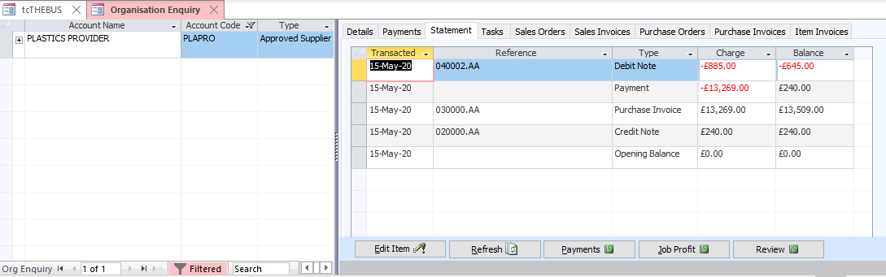
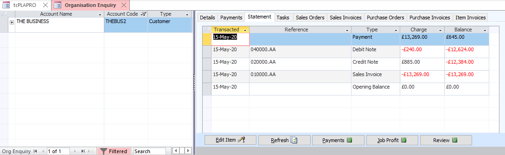

4. Should the network service have failed for technical reasons, you can doctor the status of allocations and invoice mirrors or change the Transmit Status to re-send changes. If all else fails, Trade Control works fine in stand-alone mode.  Therefore, you can always email organisations from the Document Manager or Word Templates and they can sort it out their end.

### Quotations

To obtain a quotation, you just raise a Pending Task against the supplier, who then mirror it with their cost. If you accept the cost, you amend the Unit/Total Charge and set the status to Open. It will then automatically transfer to the supply versus demand listings of both parties.

### Finally

Although we have been manually tending to the allocations, this is at root a technique from the Material Requirements Planning algorithms developed in the manufacturing sector during the 1960s. Therefore, various techniques for automating this process could be applied to maintain positive SvD balances throughout the supply chain. Any change to the state would automatically flow down the demand side and then flow back up from the supply.  Whilst the author has coded several finite and infinite scheduling algorithms, we are not going to automate at this time. But you can understand that the process you have covered in the demo is a practical implementation of [supply-chain scheduling](https://github.com/iamonnox/tradecontrol/blob/master/docs/tc_functions.md#supply-and-demand).

Furthermore, investigate the Network Interface transaction and event history generated by the three business nodes and trace to the Contract Calls and Deployments in the Ganache RPC Server. You can confirm how the information has been communicated over the EVM and immutably recorded in the contracts written to the blockchain. Therefore, switching to a [public blockchain](../readme.md#public-network) would mean any number of nodes can be connected and synchronised from anywhere in the world.   

## Licence

Trade Control Documentation by Trade Control Ltd is licenced under a [Creative Commons Attribution-ShareAlike 4.0 International License](http://creativecommons.org/licenses/by-sa/4.0/) 

 

